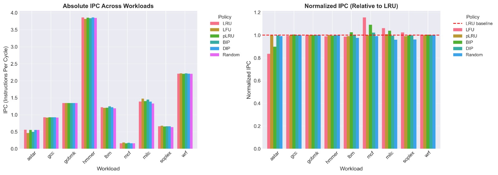
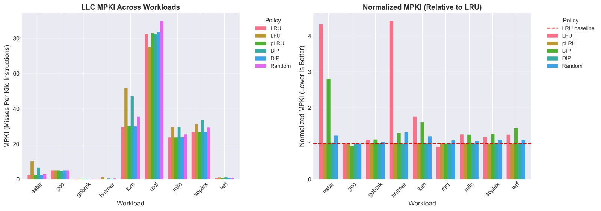
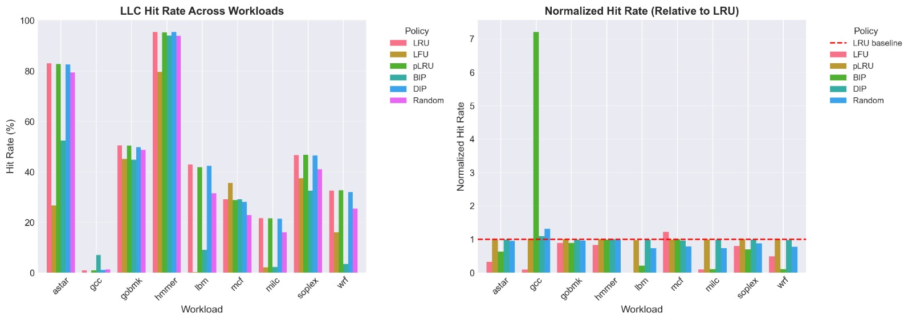
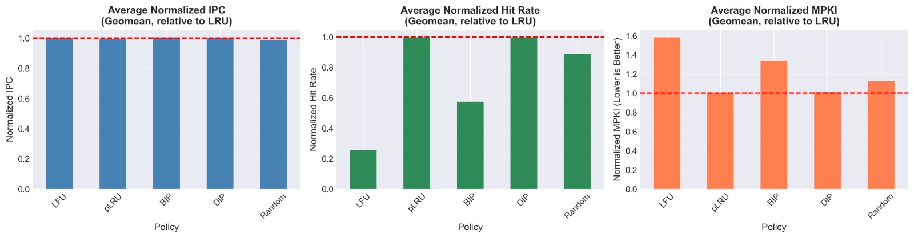

# High-Performance Cache Replacement Policies for Last-Level Caches

Implementation and evaluation of multiple cache replacement policies for the Last-Level Cache (LLC) using the ChampSim microarchitecture simulator. This project explores the impact of cache replacement algorithms on processor performance by analyzing IPC, MPKI, and cache hit rates across a diverse set of benchmark workloads.

---

## Overview

Modern processors rely heavily on efficient cache hierarchies to bridge the performance gap between CPU cores and main memory. The effectiveness of a cache is strongly influenced by its replacement policy, which determines which cache line should be evicted when new data must be inserted.

This project investigates several cache replacement strategies ranging from simple baseline approaches to adaptive policies that dynamically respond to workload behavior. Each policy was implemented within the ChampSim simulation framework and evaluated using multiple benchmark traces representative of real-world applications.

Performance was analyzed using Instructions Per Cycle (IPC), Misses Per Kilo Instructions (MPKI), and Last-Level Cache hit rates.

---

## Objectives

* Implement multiple LLC replacement policies within ChampSim
* Analyze cache behavior across diverse workloads
* Compare performance using IPC, MPKI, and hit-rate metrics
* Study the trade-offs between replacement complexity and performance
* Evaluate adaptive insertion policies for modern processor cache hierarchies

---

## Implemented Policies

### Random

A baseline replacement policy that selects a victim cache line uniformly at random.

**Characteristics**

* Minimal hardware overhead
* No reuse tracking
* Serves as a performance baseline

---

### Least Frequently Used (LFU)

Tracks cache-line access frequency using saturating counters and evicts the least frequently accessed cache line.

**Characteristics**

* Captures long-term reuse patterns
* Favors frequently accessed data
* Additional metadata overhead

---

### Pseudo-Least Recently Used (pLRU)

Tree-based approximation of LRU that significantly reduces replacement-state overhead while preserving similar replacement behavior.

**Characteristics**

* Lower hardware cost than true LRU
* Efficient implementation for high associativity caches
* Widely used in commercial processors

---

### Bimodal Insertion Policy (BIP)

Inserts most incoming cache lines near the LRU position while occasionally inserting at MRU.

**Characteristics**

* Reduces cache pollution
* Improves cache residency for frequently reused data
* Simple adaptive behavior

---

### Dynamic Insertion Policy (DIP)

Uses set dueling and a global policy selector to dynamically choose between LRU-style and BIP-style insertion behavior.

**Characteristics**

* Workload-aware adaptation
* Balances recency and pollution resistance
* Representative of modern adaptive cache-management techniques

---

## Experimental Methodology

### Simulator

* ChampSim Trace-Driven Simulator

### Metrics

* Instructions Per Cycle (IPC)
* Misses Per Kilo Instructions (MPKI)
* LLC Hit Rate
* Geomean

### Workloads

Performance was evaluated using multiple benchmark traces including:

* astar
* gcc
* gobmk
* hmmer
* lbm
* mcf
* milc
* wrf

The use of diverse workloads enables comparison across both memory-intensive and compute-intensive applications.

---

## Performance Results

The implemented cache replacement policies were evaluated using ChampSim across multiple benchmark workloads. Performance was measured using Instructions Per Cycle (IPC), Misses Per Kilo Instructions (MPKI), and Last-Level Cache (LLC) hit rate. Geometric mean performance was also computed to compare overall policy effectiveness across the complete benchmark suite.

### IPC Comparison



IPC was used as the primary metric for evaluating processor throughput. While most replacement policies exhibited workload-dependent behavior, adaptive insertion strategies consistently delivered stronger overall performance than simpler replacement mechanisms.

---

### MPKI Comparison



MPKI (Misses Per Kilo Instructions) measures the frequency of cache misses experienced during execution. Lower MPKI values indicate improved cache utilization and reduced memory access latency. The adaptive insertion policies demonstrated improved resistance to cache pollution and generally achieved lower miss rates across the benchmark suite.

---

### LLC Hit Rate Comparison



LLC hit rate provides insight into how effectively each policy retains useful cache lines. Higher hit rates reduce off-chip memory traffic and improve overall system performance. Policies that better exploit temporal locality consistently achieved stronger cache utilization.

---

### Geometric Mean Performance



To compare overall effectiveness across all workloads, geometric mean performance metrics were computed for each replacement policy. This provides a workload-independent view of policy behavior and highlights the trade-offs between replacement complexity, cache efficiency, and processor performance.

---

## Key Findings

* Random replacement consistently underperformed due to the lack of locality awareness.
* pLRU achieved performance close to LRU while requiring significantly less replacement-state storage.
* LFU improved cache retention for frequently reused data but occasionally suffered from stale history effects.
* BIP delivered the strongest average IPC improvement by reducing cache pollution from low-reuse cache lines.
* DIP successfully adapted to varying workload characteristics and maintained strong overall performance.

---

## Repository Structure

```text
high-performance-llc-policies/
├── replacement/
│   ├── random.cc
│   ├── lfu.cc
│   ├── plru.cc
│   ├── bip.cc
│   └── dip.cc
│
├── reports/
│   └── project_report.pdf
│
├── results/
│   ├── ipc_comparison.png
│   ├── mpki_comparison.png
│   |── hitrate_comparison.png
│   └── geomean_comparison.png
│
└── README.md
```

---

## Learning Outcomes

* Cache hierarchy design
* Memory-system optimization
* Replacement-policy implementation
* Adaptive hardware algorithms
* Trace-driven architectural simulation
* Performance evaluation and benchmarking
* Computer architecture research methodologies
* Quantitative performance analysis
